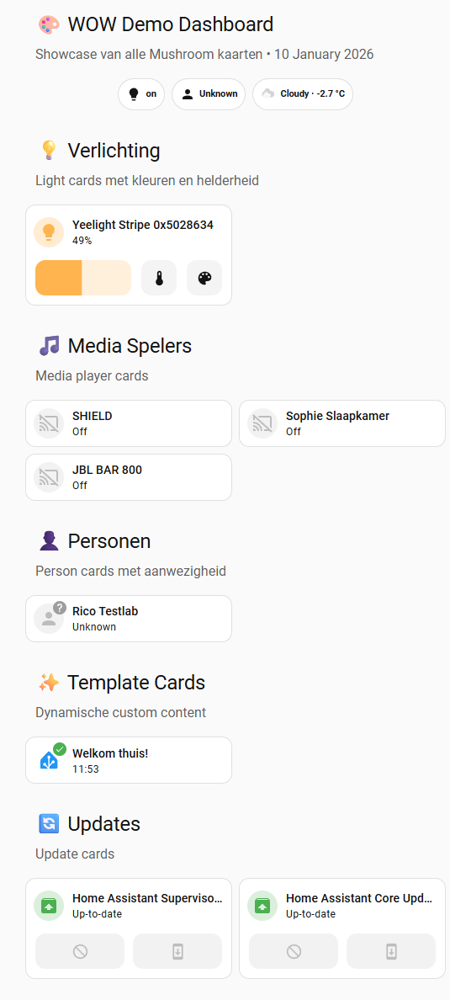
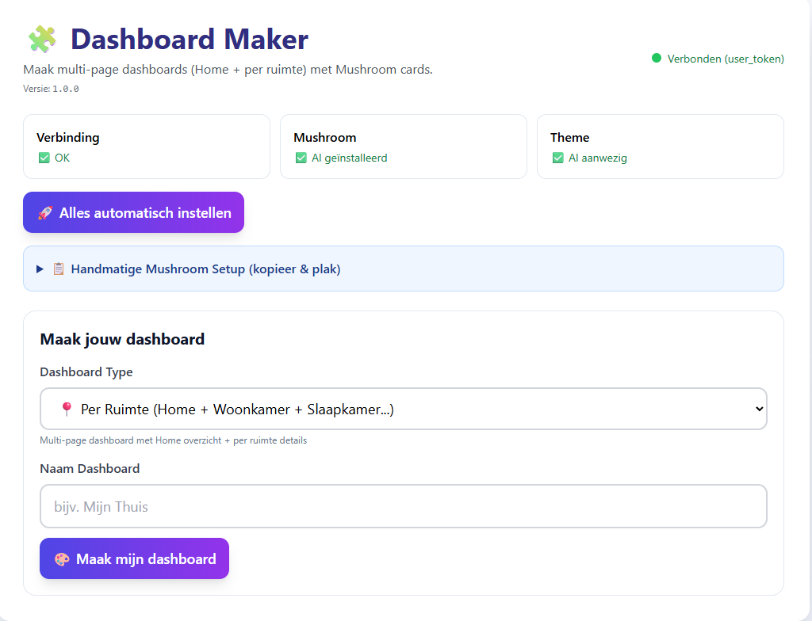

# Dashboard Maker (Home Assistant Add-on)

🧠 Hoe werkt het?
De app leest:

- States
- Areas
- Entity Registry
- Bouwt automatisch:
- Home / Overview
- Per-ruimte pagina’s

Slaat dashboards op in: /config/dashboards/

configuration.yaml → lovelace → dashboards

⚠️ BELANGRIJK – Bekende Home Assistant bug
❗ Dashboard keys MOETEN een - (hyphen) bevatten
Dit is een bekende validatiebug in Home Assistant.

❌ FOUT

dashboards:
  woonkamer:
  
✅ GOED

dashboards:
  dash-woonkamer:
  
🧩 Minimale configuration.yaml

default_config:

lovelace:
  mode: yaml
  resources:
    - url: /local/community/lovelace-mushroom/dist/mushroom.js
      type: module
  dashboards: {}

Daarna: Home Assistant herstarten

🍄 Mushroom – Handmatige stap (verplicht in YAML mode)
Home Assistant kan geen Lovelace resources registreren via API in YAML mode.

Daarom moet je éénmalig handmatig toevoegen:

lovelace:
  resources:
    - url: /local/community/lovelace-mushroom/dist/mushroom.js
      type: module
      
De UI bevat:

📋 Kopieer-knop

📄 RESOURCES_EXAMPLE.yaml bestand

🔧 Setup workflow (aanbevolen)

Installeer Mushroom (HACS)

Voeg Mushroom resource toe (zie hierboven)

Reload YAML config / herstart HA

Run Setup in de Dashboard Maker

Maak je dashboard

Druk op F5

Klaar 🎉

🛠️ Troubleshooting Flowchart

Dashboard niet zichtbaar?
        ↓
Bestaat YAML bestand?
        ↓
Ja → Is dashboard geregistreerd?
        ↓
Ja → Bevat key een '-'?
        ↓
Ja → YAML herladen / HA herstart
        ↓
Nog niks?
        ↓
Gebruik /api/debug/dashboards

🔍 Debug endpoints
Endpoint	Doel
/api/debug/connection	Token / API debug
/api/debug/config_yaml	Config validatie
/api/debug/dashboards	Dashboard registratie
/api/config	Algemene status

🧩 Waarom YAML en geen Storage?

YAML	Storage
Git-vriendelijk	UI-only
Voorspelbaar	Fragiel
Scriptbaar	Niet versie-vast
Aanbevolen voor power users	Voor beginners

🛡️ Veiligheid & Backups

Elke wijziging maakt een backup:

configuration.yaml.backup_YYYYMMDD_HHMMSS
Geen bestaande config wordt overschreven
Alleen benodigde keys worden toegevoegd

🏪 Home Assistant Add-on Store beschrijving

Maak automatisch moderne, multi-page dashboards in Home Assistant op basis van je ruimtes.
Volledig YAML-based, Mushroom-ready en Git-vriendelijk.

Categorie: Lovelace / Dashboard
Ondersteunt: YAML mode
Status: Stable

📦 Wat deze add-on NIET doet (bewust)

❌ Geen lovelace.reload (werkt niet in YAML)
❌ Geen resource auto-injectie (HA beperking)
❌ Geen storage dashboards (onstabiel)

❤️ Credits & Dank

- Home Assistant Core
- Mushroom Cards
- Community testers
- Iedereen die YAML boven UI verkiest 😉

📄 Licentie
MIT License
